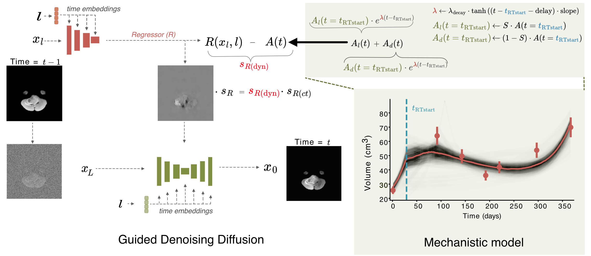
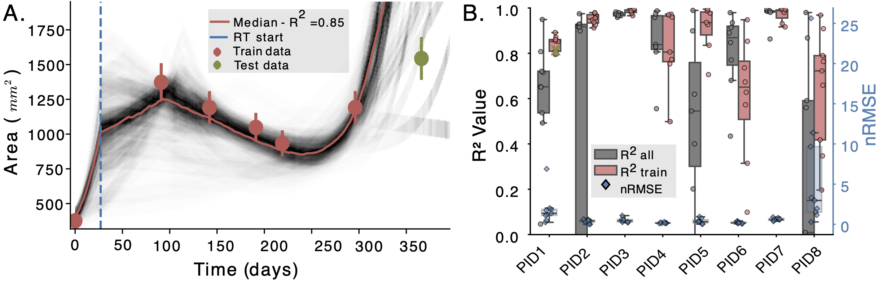

<div id="readme-top"></div>

<div align="center">
<h1 align="center"> Mechanistic Learning with Guided Diffusion Models to Predict Spatio-Temporal Brain Tumor Growth </h1>
Accepted at LMID Workshop at MICCAI, 2025
  <p align="center">
    <a href="https://github.com/CAIROLab-Bern/Mechanistic-Learning-Brain-Tumor-Growth.git">Report Bug</a>
  </p>

   <p align="center">
     
   </p>
</div>

<!-- TABLE OF CONTENTS -->
<details>
  <summary>Table of Contents</summary>
  <ol>
    <li>
      <a href="#-paper-overview">📋 Paper Overview</a>
    </li>
    <li>
      <a href="#-project-organization">📁 Project Organization</a>
    </li>
    <li>
      <a href="#-installation">⚙️ Installation</a>
    </li>
    <li>
      <a href="#-diffusion-model">🌊 Diffusion Model</a>
      <ul>
        <li><a href="#data-format">Data Format</a></li>
        <li><a href="#diffusion-model-training">Diffusion Model Training</a></li>
        <li><a href="#regressor-training">Regressor Training</a></li>
        <li><a href="#generationinference">Generation/Inference</a></li>
      </ul>
    </li>
    <li>
      <a href="#-mechanistic-dmg-ode-model">🧬 Mechanistic DMG ODE Model</a>
    </li>
    <li>
      <a href="#-citation">📖 Citation</a>
    </li>
    <li>
      <a href="#-license">📄 License</a>
    </li>
    <li>
      <a href="#-acknowledgments">🙏 Acknowledgments</a>
    </li>
    <li>
      <a href="#-contact">📧 Contact</a>
    </li>
  </ol>
</details>

## 📋 Paper Overview

Predicting the spatio-temporal progression of brain tumors is essential for guiding clinical decisions in neuro-oncology. We propose a hybrid mechanistic learning framework that combines a mathematical tumor growth model with a guided denoising diffusion implicit model (DDIM) to synthesize anatomically feasible future MRIs from preceding scans. The mechanistic model, formulated as a system of ordinary differential equations, captures temporal tumor dynamics including radiotherapy effects and estimates future tumor burden. These estimates condition a gradient-guided DDIM, enabling image synthesis that aligns with both predicted growth and patient anatomy. We train our model on the BraTS adult and pediatric glioma datasets and evaluate on 60 axial slices of in-house longitudinal pediatric diffuse midline glioma (DMG) cases. Our framework generates realistic follow-up scans based on spatial similarity metrics. It also introduces tumor growth probability maps, which capture both clinically relevant extent and directionality of tumor growth as shown by 95th percentile Hausdorff Distance. The method enables biologically informed image generation in data-limited scenarios, offering generative-space-time predictions that account for mechanistic priors.

#### TL;DR

> We couple a mechanistic biological tumor growth model with diffusion-based image generation to predict follow-up MR brain scans. The tumor model provides biologically plausible predictions of how much the tumor will grow, which then guides a diffusion model to generate realistic and anatomicaly constrained follow-up scans. We generate **probabilistic growth maps** showing where tumor progression is most likely to occur.

## 📁 Project Organization

```
├── data/                    
│   ├── training/            <- Diffusion model training data (T1N, T1C, T2W, T2F, SEG per sample)
│   ├── validation/          <- Validation data (T1N, T1C, T2W, T2F per sample)
│   ├── testing/             <- Test data (T1N, T1C, T2W, T2F per sample)
│   └── test_labels/         <- Segmentation files for testing and validation
│
├── src_diffusion/           <- Guided denoising diffusion framework
│   ├── __init__.py
│   ├── guided_diffusion/    <- Core guided diffusion modules
│   └── scripts/             <- Training and inference scripts
│       ├── config/          <- Configuration files and default arguments
│       ├── train.py
│       └── inference.py
│
├── src_mech_ode/         <- Mechanistic tumor growth modelling code
│   ├── README.md            <- Detailed documentation for mechanistic models
│   ├── tumor_model.py
│   └── ode_solver.py
│
├── utils/                   <- Shared utilities for training and analysis
├── README.md                <- Project overview and setup instructions
├── LICENSE
└── requirements.txt         <- Python dependencies
```

## ⚙️ Installation

1. Clone the repository:
    ```sh
    git clone git@github.com:CAIROLab-Bern/Mechanistic-Learning-Brain-Tumor-Growth.git

    cd Mechanistic-Learning-Brain-Tumor-Growth
    ```

2. Diffusion Model Env
    ```sh
    pip install -r requirements.txt
    ```
    
    **NOTE**: Critical requirements: Python 3.9+ & PyTorch 1.7+

3. Mechanistic Model Env: see [ODE Setup](#-ode-setup)
    

## 🌊 Diffusion Model

Our guided diffusion network relies on DDPM and a regressor (U-Net encoder with time-step embeddings) trained independently. Details on the training procedure and default arguments are provided below. Generally, configuration files available in the config folder can be used for the training and testing of models, they contain the default values for the arguments and details on their use. Config files are provided for the main training, testing and inference scripts.

### Data format

The BraTS dataset was used for training. Multiparametric axial 2D slices were used for training, testing and validation, which must be organized as follows (see data folder for a few examples):

    /data/
      training/
        pid_slice
          dataset_train_pid_seg_slice_w.nii
          dataset_train_pid_t1n_slice_w.nii
          dataset_train_pid_t1c_slice_w.nii
          dataset_train_pid_t2w_slice_w.nii
          dataset_train_pid_t2f_slice_w.nii
        pid_slice
          ...
      testing/
        pid_slice
            dataset_train_pid_<t1n/t1c/t2w/t2f>_slice_w.nii
        ...
      validation/
        pid_slice
            dataset_train_pid_<t1n/t1c/t2w/t2f>_slice_w.nii
        ...
      test_labels/
          pid_slice-label.nii.gz (test)
          pid_slice-label.nii.gz (validation)
          ...

### Diffusion model training

The 'scripts/image_train.py' script needs to be run for training the regression model, while setting the following default and specific parameters which can be found in the ```config/config_diff_train.yaml``` file. A minimal working version including the default settings is provided there. This should run with the reduced dataset provided for the testing of the codebase. 
For specific configurations a path to another config file can be specified as a command line argument ```--config ./config/new_config.yaml```. Specifically, the default parameters are:

```
--lr 1e-4 --batch_size 10 --dataset brats --image_size 256 --num_channels 128 --class_cond True --num_res_blocks 2 --num_heads 1 --learn_sigma True --use_scale_shift_norm False --attention_resolutions 16 --diffusion_steps 1000 --noise_schedule linear --rescale_learned_sigmas False --rescale_timesteps False

```

Additionally, specific arguments depending on the data and use case must be provided:
* --data_dir : path to the master directory containing your data (needs to be structured in the following directories: training, validation, testing, test_labels)
* --resume_checkpoint : path to partly trained model, if continuing training is desired
* others - additional arguments can be found in the config file

**Validation**: The script scripts/diffusion_validation.py can be used to compute the overall MSE for the training set and the validation set for a given state of the model. 

### Regressor training 

The 'scripts/regressor_train.py' script needs to be run for training the regression model, while setting the following default and specific parameters which can be found in the ```config/config_reg_train.yaml``` file. A minimal working version including the default settings is provided there. This should run with the reduced dataset provided for the testing of the codebase. 
For specific configurations a path to another config file can be specified as a command line argument ```--config ./config/new_config.yaml```. Specifically, the default parameters are:

```
--lr 1e-4 --batch_size 10 --dataset brats --image_size 256 --num_channels 128 --class_cond True --num_res_blocks 2 --num_heads 1 --learn_sigma True --use_scale_shift_norm False --attention_resolutions 16 --regressor_attention_resolutions 32,16,8 --regressor_depth 4 --regressor_width 32 --regressor_pool attention --regressor_resblock_updown True --regressor_use_scale_shift_norm True
```

Additionally, specific arguments depending on the data and use case must be provided:
* --data_dir : path to the master directory containing your data (needs to be structured in the following directories: training, testing, test_labels)(multiple directories can be specified if separated by commas)
* --resume_checkpoint : path to partly trained model, if continuing training is desired
* others - additional arguments can be found in the config file

**Validation**: The script can be instructed to perform validation every given number of iterations and store results. 

**Testing**: The script scripts/regression_test.py can be used to apply the selected regression model to the test set and calculate MSE for the predicted values. 

### Generation/Inference

To generate samples using the guided diffusion network, the gd_regressor_sample_known.py needs to be run. The paths of the already trained diffusion model and regression model need to be provided. The specific parameters can be found in the ```config/config_gd.yaml``` file. The generation can be guided towards a fixed relative change, by setting ```--constant_relative_change True``` and specifying the exact value with ```--relative_change xxx```. If specific relative changes are expected for the different samples, a dictionary (saved as pickle) is defined, specifying the sample as key and the target image (if available: longitudinal samples) and the relative change (an example file is provided for the dummy validation set in ```data/targets_dict.pkl```). 

**NOTES**:
* The name for the model_path or regressor_path should be in the following format: modelxxxxxx.pt, where xxxxxx is the the number of iterations the training ran for. 

## 🧬 Mechanistic DMG ODE model

A simple mechanistic ODE model for Diffuse Midline Glioma (DMG) tumor evolution with two phases:
1) preRT: (standard) tumor growth 
2) postRT: radiation therapy response modelling

### 📄 Paper Results

The ODE models is fitted across the existing patient measurements and is then used to predict the follow-up scan area.

<div align="center">



**Fig. A.** ODE curve fitting (red) on 6 Area measurements, and estimation (green) on the 7th. The black curves denote independent bootstrap fits.;
**Fig. B.** Mechanistic modeling performance metrics. $R^2(\uparrow)$ on the left and nRMSE($\downarrow$) on the right vertical axis respectively. Green cross (on PID1) highlights the example displayed in Fig. A.

</div>

### 💾 [ODE Setup](#-ode-setup)

#### Prerequisites
- Python 3.10+
- `numpy` 1.24.4
- `lmfit` 1.2.0
- [uv](https://github.com/astral-sh/uv) package manager

#### Environment

1. **Install uv** (if not already installed):
   ```bash
   curl -LsSf https://astral.sh/uv/install.sh | sh
   ```

2. **Clone repository**:
   ```bash
   cd src_mech_ode
   ```

3. **Create and activate virtual environment**:
   ```bash
   uv venv --python 3.10
   source .venv/bin/activate
   ```

4. **Install package in development mode**:
   ```bash
   uv pip install -e .
   ```

### 🩻 Data

The main data file is a pickled Python dictionary containing longitudinal tumor area measurement data for multiple patients and slices, e.g., ``area_over_time_dict.pkl``

#### 📁 File Structure
```
area_over_time_dict.pkl
├── patient_1: pandas.DataFrame
├── patient_2: pandas.DataFrame
├── patient_3: pandas.DataFrame
└── ...
```

#### Data Schema

Each patient is represented by a pandas DataFrame with the following columns:

- `time(rel_days)`: Relative time in days from first imaging
- `time_end_RT(rel_days)`: Days until/since radiotherapy (RT) ends
  - Negative values: RT will end in the future (prospective data)
  - Positive values: RT ended in the past (retrospective data)
- `volume_manual`: Manual tumor area/volume measurements
- `slice_initial_X`: Initial slice area measurements (where X is slice ID)
- `slice_largest_X`: Largest slice area measurements (where X is slice ID)

Our script automatically calculates radiotherapy (RT) timelines using a standard 6 week (42 days) RT duration. RT start is calculated as `time_end_RT - 42`

### 🧑🏾‍💻 Usage

Boostrap fitting of ODE models on perturbed data.

#### Step-1: Random guess bootstrap fit
```bash
bash run_bootstrap_dmg_full.sh
```

This script utilizes `run_dmg_full.py` which has the following command line arguments:

##### Required Arguments
- `patient`: Patient ID to analyze, e.g., `PID001`
- `data_type`: `initial` or `largest` for MRI slices
- `n_bootstrap`: number of bootstraps to run
- `noise_level`: amount of noise added to initial measurements (10% in our implementation)
- `n_jobs`
- `output_dir`
- `normalization`: normalizes volume/area measurements
- `no_volume`: discard initial volume param from ODE fit

The results over all patients are stored under `output_dir`. For each patient there is a `PID` folder which contains both `all` and `train` results. `all` means that we fit the ODE model across all available data while `train` means we train across all but the last. (see paper for more details)

#### Step-2 (Optional)

Based on the fits of the first step we can hope to get some better parameter initialization and contraint bounds and run an additional fit with better results.
To do this simply add `--bootstrap_path` argument with the output folder from the previous fit in the `run_boostrap_dmg_full.sh` and change the output folder in the beginning of the script too.

### 🖼️ Plots

#### Fig. A. 📈

To generate plots like in Fig. A. for all patients, slices and modes run:
```bash
plot_pretty_gc_batch.sh
```
where in the beginning of the bash script you modify `RESULTS_DIR` to be the folder where the ODE fit results lie.

#### Fig. B. 📊

Change the `folder` variable in the start of the script `boxplotsPerformance.py` and then run

```bash
python boxplotsPerformance.py
```

### 🔬 ODE Model Parameters

| Parameter | Description |
|-----------|-------------|
| `lambda_gr` | Growth rate (/day) |
| `lambda_decay` | Decay rate coefficient |
| `delay` | Treatment response delay (days) |
| `slope` | Response transition steepness |
| `SD_1` | Radiation survival fraction |
| `V_01` | Initial normalized volume |

## 📖 Citation
If you find this work useful for your research, please consider citing our paper and giving us a ⭐:

```tex
@article{
}
```

## 📄 License

Distributed under the Apache License Version 2.0, License. See `LICENSE` for more information.

<p align="right">(<a href="#readme-top">back to top</a>)</p>

## 🙏 Acknowledgments

* [BraTS Dataset Adult](synapse.org/Synapse:syn51156910) We gratefully acknowledge the BraTS dataset (DOI: 10.1109/TMI.2014.2377694) provided through the BraTS Challenge as part of MICCAI.  This comprehensive multi-center multi-parametric dataset with tumor segmentations has been instrumental in training and validating our models.
* [BraTS Dataset PED](synapse.org/Synapse:syn51156910) We gratefully acknowledge the SPIDER dataset (DOI: 10.59275/j.melba.2025-f6fg) provided through the BraTS Challenge as part of MICCAI.   This comprehensive multi-center multi-parametric **pediatric** dataset with tumor segmentations has been instrumental in training and validating our models.
* [Wolleb et al.](10.1007/978-3-031-16452-1_4) Our diffusion model implementation builds on the repository developed by Wolleb et al. (https://gitlab.com/cian.unibas.ch/diffusion-anomaly).

<p align="right">(<a href="#readme-top">back to top</a>)</p>

## 📧 Contact

- Daria Laslo: PhD Student at ETH Zürich Biomedical Data Science Lab 
[Email Me](daria.laslo@hest.ethz.ch)  
[Github Profile](https://github.com/darialaslo)

- [Efthymis Georgiou](https://scholar.google.com/citations?user=5Sc6GvEAAAAJ&hl=en) | [github](https://github.com/efthymisgeo) | efthymios[dot]georgiou[at]unibe[dot]ch

<p align="right">(<a href="#readme-top">back to top</a>)</p>