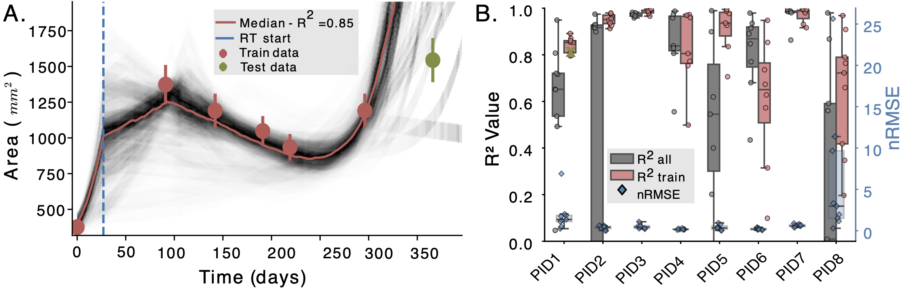

# 🧬 Mechanistic DMG ODE model

A simple mechanistic ODE model for Diffuse Midline Glioma (DMG) tumor evolution with two phases:
1) preRT: (standard) tumor growth 
2) postRT: radiation therapy response modelling

## 📄 Paper Results

The ODE models is fitted across the existing patient measurements and is then used to predict the follow-up scan area.

<div align="center">



**Fig. A.** ODE curve fitting (red) on 6 Area measurements, and estimation (green) on the 7th. The black curves denote independent bootstrap fits.;
**Fig. B.** Mechanistic modeling performance metrics. $R^2(\uparrow)$ on the left and nRMSE($\downarrow$) on the right vertical axis respectively. Green cross (on PID1) highlights the example displayed in Fig. A.


</div>

## 🩻 Data

The main data file is a pickled Python dictionary containing longitudinal tumor area measurement data for multiple patients and slices, e.g., ``area_over_time_dict.pkl``

### 📁 File Structure
```
area_over_time_dict.pkl
├── patient_1: pandas.DataFrame
├── patient_2: pandas.DataFrame
├── patient_3: pandas.DataFrame
└── ...
```

### Data Schema

Each patient is represented by a pandas DataFrame with the following columns:

- `time(rel_days)`: Relative time in days from first imaging
- `time_end_RT(rel_days)`: Days until/since radiotherapy (RT) ends
  - Negative values: RT will end in the future (prospective data)
  - Positive values: RT ended in the past (retrospective data)
- `volume_manual`: Manual tumor area/volume measurements
- `slice_initial_X`: Initial slice area measurements (where X is slice ID)
- `slice_largest_X`: Largest slice area measurements (where X is slice ID)

Our script automatically calculates radiotherapy (RT) timelines using a standard 6 week (42 days) RT duration. RT start is calculated as `time_end_RT - 42`

## 🧑🏾‍💻 Usage

Boostrap fitting of ODE models on perturbed data.

### Step-1: Random guess bootstrap fit
```bash
bash run_bootstrap_dmg_full.sh
```

This script utilizes `run_dmg_full.py` which has the following command line arguments:

#### Required Arguments
- `patient`: Patient ID to analyze, e.g., `PID001`
- `data_type`: `initial` or `largest` for MRI slices
- `n_bootstrap`: number of bootstraps to run
- `noise_level`: amount of noise added to initial measurements (10% in our implementation)
- `n_jobs`
- `output_dir`
- `normalization`: normalizes volume/area measurements
- `no_volume`: discard initial volume param from ODE fit

The results over all patients are stored under `output_dir`. For each patient there is a `PID` folder which contains both `all` and `train` results. `all` means that we fit the ODE model across all available data while `train` means we train across all but the last. (see paper for more details)

### Step-2 (Optional)

Based on the fits of the first step we can hope to get some better parameter initialization and contraint bounds and run an additional fit with better results.
To do this simply add `--bootstrap_path` argument with the output folder from the previous fit in the `run_boostrap_dmg_full.sh` and change the output folder in the beginning of the script too.

## 🖼️ Plots

### Fig. A. 📈

To generate plots like in Fig. A. for all patients, slices and modes run:
```bash
plot_pretty_gc_batch.sh
```
where in the beginning of the bash script you modify `RESULTS_DIR` to be the folder where the ODE fit results lie.

### Fig. B. 📊

Change the `folder` variable in the start of the script `boxplotsPerformance.py` and then run

```bash
python boxplotsPerformance.py
```

## 🔬 ODE Model Parameters

| Parameter | Description |
|-----------|-------------|
| `lambda_gr` | Growth rate (/day) |
| `lambda_decay` | Decay rate coefficient |
| `delay` | Treatment response delay (days) |
| `slope` | Response transition steepness |
| `SD_1` | Radiation survival fraction |
| `V_01` | Initial normalized volume |